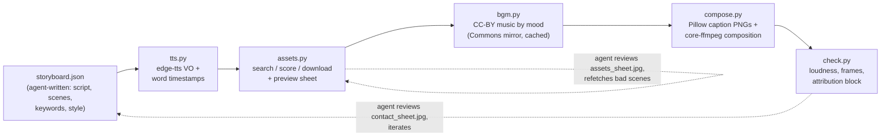

# tiktok-video — one-shot TikTok/Douyin video generation skill for AI agents

**English** | [简体中文](README.zh-CN.md)

[](https://github.com/Fangyuan025/tiktok-video-skill/actions/workflows/ci.yml)
[](LICENSE)
[](https://code.claude.com/docs/en/skills)
[](https://www.python.org/)
[](#faq)
[](https://github.com/Fangyuan025/tiktok-video-skill/pulls)

**One-line brief in → publish-ready vertical video out.** A skill following the
[Agent Skills](https://code.claude.com/docs/en/skills) open standard, usable by any
capable AI agent — Claude Code, Cursor, Codex CLI, Gemini CLI, OpenCode and more:

> user brief → agent writes the script & storyboard → searches and downloads
> free stock assets → TTS voiceover (Chinese & English) → word-level karaoke
> captions → background music with voice ducking → final 1080×1920 MP4


*Frames from three fully auto-generated test videos (zh karaoke captions / en NASA imagery / zh pop captions with emphasis).*

## What it produces

- 1080×1920 (or 16:9 / 1:1), 30 fps, H.264 + AAC, loudness normalized to −15 LUFS
- Marketing-account style: big hook title in the first seconds → word-by-word
  highlighted captions → Ken Burns motion → BGM sidechain-ducked under the voice → CTA ending
- **Zero API keys required**: real video clips from Wikimedia Commons, NASA and
  the Prelinger Archives, plus images from Openverse/Wikimedia/NASA;
  music by Kevin MacLeod (CC-BY, mirrored on Wikimedia Commons).
  Optional free `PEXELS_API_KEY` / `PIXABAY_API_KEY` unlock real stock video clips
- An attribution block for CC sources, generated automatically

## Install

Requires `ffmpeg` (any regular build — no libass needed) and `python3`.

```bash
# Claude Code
git clone https://github.com/Fangyuan025/tiktok-video-skill ~/.claude/skills/tiktok-video
# any other SKILL.md-compatible agent: clone into its skills directory
```

The agent runs `bash scripts/setup.sh` on first use (venv, edge-tts/requests/pillow,
Noto CJK font download).

## Use

Tell your agent:

> Make me a TikTok video about 3 mind-blowing space facts
>
> 帮我做一个关于「深海最诡异的生物」的抖音短视频

The agent follows [SKILL.md](SKILL.md): write the storyboard → run the pipeline →
**visually review assets and the final cut** (this review loop is what makes the
quality) → deliver `final.mp4` plus the attribution text.

Fully manual use (no agent required):

```bash
bash scripts/setup.sh
mkdir -p projects/my-video
cp examples/space-facts-en.json projects/my-video/storyboard.json   # edit it
.venv/bin/python scripts/pipeline.py projects/my-video
open projects/my-video/final.mp4
```

## How it works



Design principle: **the agent does the creative work, deterministic scripts do the
mechanical work.** Every stage can be rerun independently; single scenes can be
refetched (`assets.py --scene 3 --keywords "..."`); the agent closes the quality
loop by looking at `assets_sheet.jpg` / `contact_sheet.jpg` with its vision.

No libass or drawtext needed — captions are rendered by Pillow and overlaid with
core ffmpeg filters only, so it runs on minimal ffmpeg builds.

## Storyboard format

See the full field table in [SKILL.md](SKILL.md); [examples/](examples/) contains
three storyboards that produced the videos above.

## FAQ

- **Does it work without any API key?** Yes. Keyless mode uses CC images plus
  Ken Burns motion (the classic faceless-channel look). Free Pexels/Pixabay keys
  are auto-detected and unlock real stock footage.
- **Which languages?** Chinese and English are fully tested; other edge-tts
  languages should work in principle (PRs welcome).
- **Commercial use?** All assets come from CC / public-domain sources and
  `check.py` emits the attribution text to paste into your video description
  (Kevin MacLeod music is CC-BY and requires it). Follow each platform's rules
  and the individual asset licenses.
- **Linux?** Works (system ffmpeg required; emoji captions need NotoColorEmoji,
  otherwise emoji are skipped automatically).

## License

Code is MIT ([LICENSE](LICENSE)). Third-party media in generated videos keeps its
original license — see the per-project `review/report.txt` attribution block.
Use for legitimate content only; don't produce misinformation or infringing material.
