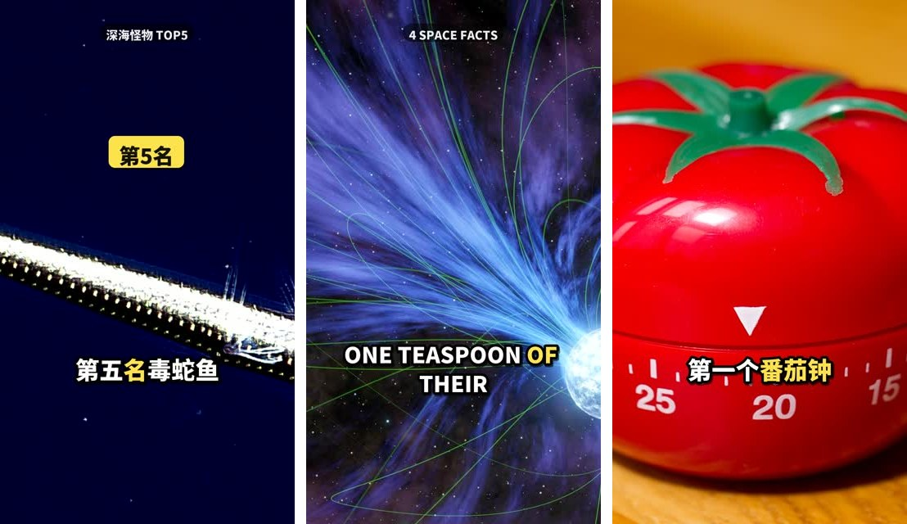
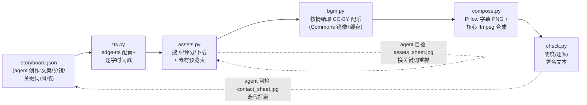

# tiktok-video — 一键生成抖音/TikTok 短视频的通用 Agent Skill

[English](README.md) | **简体中文**

[](https://github.com/Fangyuan025/tiktok-video-skill/actions/workflows/ci.yml)
[](LICENSE)
[](https://code.claude.com/docs/en/skills)
[](https://www.python.org/)
[](#faq)
[](https://github.com/Fangyuan025/tiktok-video-skill/pulls)

**一句话需求进,成片出。** 遵循 [Agent Skills](https://code.claude.com/docs/en/skills)
开放标准,任何有能力的 AI agent(Claude Code、Cursor、Codex CLI、Gemini CLI、OpenCode 等)
都能直接使用:

> 用户一句话需求 → agent 写文案分镜 → 自动联网搜索并下载素材 → TTS 配音(中/英)→
> 逐字卡拉OK字幕 → 配乐 + 人声闪避 → 直出 1080×1920 成片 MP4



*三支全自动生成的实测视频帧(中文卡拉OK字幕 / 英文 NASA 素材 / 中文 pop 字幕+强调词)。*

## 产出效果

- 1080×1920(或 16:9 / 1:1)、30fps、H.264 + AAC、响度标准化 -15 LUFS
- 营销号风格:前 3 秒大字 Hook 标题 → 逐字高亮字幕 → Ken Burns 动效 →
  BGM 自动闪避人声 → 结尾 CTA
- **零 API key 可用**:实拍视频来自 Wikimedia Commons、NASA、Prelinger 档案馆,图片来自 Openverse/Wikimedia/NASA;
  音乐为 Kevin MacLeod (CC-BY,Wikimedia Commons 镜像)。
  可选免费 `PEXELS_API_KEY` / `PIXABAY_API_KEY`,自动启用实拍视频素材
- 自动生成 CC 素材署名文本,合规使用

## 安装

需要 `ffmpeg`(任意常规构建,无需 libass)和 `python3`:

```bash
# Claude Code
git clone https://github.com/Fangyuan025/tiktok-video-skill ~/.claude/skills/tiktok-video
# 其他支持 SKILL.md 标准的 agent:clone 到其对应 skills 目录即可
```

首次使用时 agent 会自动运行 `bash scripts/setup.sh`(创建 venv、安装
edge-tts/requests/pillow、下载 Noto CJK 字体)。

## 使用

对你的 agent 说:

> 帮我做一个关于「深海最诡异的生物」的抖音短视频
>
> Make me a TikTok video about 3 mind-blowing space facts

Agent 会按 [SKILL.md](SKILL.md) 流程执行:写分镜 → 跑管线 → **用视觉审查素材和成片**
(这个审查闭环是质量的关键)→ 交付 `final.mp4` + 署名文本。

也可完全手动使用(不依赖任何 agent):

```bash
bash scripts/setup.sh
mkdir -p projects/my-video
cp examples/deep-sea-zh.json projects/my-video/storyboard.json   # 编辑它
.venv/bin/python scripts/pipeline.py projects/my-video
open projects/my-video/final.mp4
```

## 工作原理



设计原则:**agent 干创意的活,确定性脚本干机械的活。** 每个阶段可独立重跑,
单场景可重抓(`assets.py --scene 3 --keywords "..."`),agent 通过看
`assets_sheet.jpg` / `contact_sheet.jpg` 闭环把控质量。

不依赖 libass/drawtext——字幕由 Pillow 渲染成 PNG 再用核心 ffmpeg 滤镜叠加,
精简版 ffmpeg 也能跑。

## 分镜格式

完整字段表见 [SKILL.md](SKILL.md);[examples/](examples/) 内有上图三支视频的分镜源文件。

## FAQ

- **不装任何 key 能用吗?** 能。免 key 模式用 CC 图片 + Ken Burns 动效(经典营销号形态);
  Pexels/Pixabay 免费 key 配好后自动启用实拍视频片段。
- **支持哪些语言?** 中文和英文经过完整测试;edge-tts 支持的其他语言理论可用(欢迎 PR)。
- **商用合规?** 素材全部来自 CC/公有领域源,`check.py` 会输出需随视频发布的署名文本
  (Kevin MacLeod 音乐为 CC-BY,必须署名)。请遵守各平台与素材许可条款。
- **Linux 可用吗?** 可以(需系统 ffmpeg;emoji 字幕需 NotoColorEmoji,否则自动跳过 emoji)。

## License

代码 MIT([LICENSE](LICENSE))。生成视频中的第三方素材遵循其原始许可(署名信息见各项目
`review/report.txt`)。仅供合法内容创作,请勿用于虚假信息或侵权内容。
